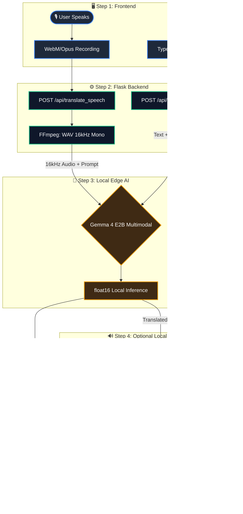

# 🌐 Gemma 4 Omni-Translator


**Offline-first multilingual communication powered by Gemma 4 and Piper Offline TTS.**

Gemma 4 Omni-Translator is a local-first Flask web app that translates speech and text using a Gemma 4 multimodal model and optional Piper offline voice synthesis.

The project is designed for privacy-sensitive and low-connectivity contexts where users may not want, or may not be able, to rely on cloud-based speech translation services.

The goal is simple: **make multilingual communication more accessible while keeping voice, text, and generated speech local at runtime.**

> First-time setup still requires downloading/caching the Gemma model and any Piper voices you want to use. After the model and voice files are available locally, the app is designed to run in offline-first mode.

---

## 🏆 Hackathon submission focus

This project is being developed for the **Gemma 4 Good Hackathon** with a focus on **Digital Equity & Inclusivity**.

Many translation tools assume stable internet access, cloud availability, and user trust in remote speech-processing services. These assumptions do not always hold.

In classrooms, migrant support desks, local workshops, travel assistance points, accessibility scenarios, and privacy-sensitive conversations, language barriers can still prevent people from understanding, learning, or being understood.

Gemma 4 Omni-Translator explores a different approach:

- speech is recorded in the browser;
- audio is converted locally with FFmpeg;
- translation is handled by a local Gemma 4 multimodal model;
- spoken output can be generated with local Piper voices;
- if no matching voice is installed, the translated text remains available and the app shows a readable warning.

The project is not intended to replace professional interpreters or certified emergency translation systems. It is a reproducible proof of concept showing how open local AI models can reduce language barriers while preserving user privacy at runtime.

---

## ▶️ Run the Demo

Explore **Gemma 4 Omni-Translator** directly in Colab:

[](https://colab.research.google.com/drive/10Hzr8qZRwoX_le15wSz7P00Ltdj6hBiG?usp=sharing)

The Colab notebook provides a quick, reproducible demo of the app.  
For the complete offline-first experience, use the local GitHub setup with Gemma 4 and Piper voices installed on your machine.

---

## 💡 Why this project?

Most voice translation applications rely on a multi-step pipeline:

```text
Speech-to-Text → Text Translation → Text-to-Speech
```

That often means sending audio or text to cloud services. Gemma 4 Omni-Translator explores a more local, privacy-oriented architecture:

1. **Local multimodal inference**  
   The browser records audio, FFmpeg converts it to 16 kHz mono WAV, and the audio is passed directly to Gemma 4. No separate Whisper/STT model is required in the app pipeline.

2. **Offline speech output with Piper**  
   The previous version used `gTTS`, which required an external Google TTS service. This refactor removes `gTTS` and uses Piper `.onnx` voices for local speech synthesis.

3. **Conversation and language-learning workflow**  
   The UI keeps a history of original recordings and translated outputs, making it useful both for bilingual conversations and EdTech-style pronunciation practice.

4. **Graceful degradation**  
   If a local Piper voice is missing, the app keeps the translated text available and returns a friendly warning instead of breaking the user workflow.

---

## 🌍 Real-world impact

Gemma 4 Omni-Translator can support scenarios where multilingual communication is needed but cloud translation is not ideal or not available.

Example use cases:

- **Low-connectivity classrooms**  
  A teacher can translate short explanations for multilingual students without depending on a remote TTS service at runtime.

- **Privacy-sensitive conversations**  
  A user can translate short spoken or written messages locally instead of sending voice data to external services.

- **Community and volunteer support**  
  Local volunteers can help visitors, migrants, or non-native speakers understand basic instructions in their own language.

- **Language learning and pronunciation practice**  
  Learners can compare original speech, translated text, and generated local audio to practice bilingual communication.

- **Offline-first demonstrations of open AI**  
  Developers and educators can study a practical local AI pipeline combining browser audio, Flask, Gemma 4, FFmpeg, and Piper.

---

## ✨ Key features

- **🎙️ Speech translation**  
  Record speech in the browser and translate it through Gemma 4 multimodal inference.

- **⌨️ Text translation**  
  Translate typed text with the same interface and optionally generate spoken output.

- **🔊 Local Piper TTS**  
  Translated text can be synthesized using local Piper `.onnx` voices. No `gTTS` dependency is used.

- **🧠 No separate Whisper/STT stage**  
  Audio is converted to the format expected by the multimodal processor and sent directly to Gemma 4.

- **💬 Auto-swap conversation mode**  
  Source and target languages can be swapped automatically after each exchange, making bilingual dialogue smoother.

- **📝 Text-only mode**  
  Both Speech and Text panels include a **Generate voice output** toggle. Turn it off to skip Piper and return only translated text.

- **🎧 EdTech shadowing workflow**  
  Original audio and synthesized translation can be played back and downloaded from the chat history.

- **🛡️ Friendly error handling**  
  Missing Piper voices, missing audio, FFmpeg errors, or TTS failures are shown as readable warnings instead of raw tracebacks.

- **📚 Piper catalogue driven**  
  Voice selection is based on `piper_voices.json` plus the `.onnx` files actually installed inside `voices/`. The `.env` file no longer needs one variable per language.

- **🌍 Broad language UI**  
  The interface exposes many target languages for translation prompts. Audio is generated only when a matching local Piper voice is installed.

---

## 🧪 Demo scenarios for judges

The project can be tested through three simple workflows:

1. **Speech translation with local voice output**  
   Record a short sentence, translate it into a target language, and play the generated Piper audio if the local voice is installed.

2. **Speech translation without available Piper voice**  
   Select a target language without a local voice. The app should still return the translated text and show a readable warning.

3. **Text-only translation**  
   Disable **Generate voice output** and use the text panel to translate a written sentence without invoking Piper.

Recommended sample prompts:

```text
Hello, I need help finding the train station.
```

```text
I am a student and I would like to practice this sentence in Italian.
```

```text
Please explain this instruction in simple words.
```

---

## 🏗️ Architecture



---

## 📁 Project structure

```text
.
├── app.py                    # Flask app + Gemma inference endpoints
├── tts_engine.py             # Offline Piper TTS resolver/invoker
├── piper_voices.json         # Piper voice catalogue
├── requirements.txt          # App dependencies, excluding PyTorch CUDA
├── .env.example              # Minimal runtime configuration
├── .env                      # Local runtime configuration
├── templates/
│   └── index.html            # Offline UI, vanilla HTML/CSS/JS
├── tools/
│   └── check_piper_voices.py # Diagnostic tool for local Piper voices
└── voices/
    └── README.md             # Put Piper .onnx voice files here
```

---

## ✅ Requirements

Recommended environment:

- Python 3.11
- NVIDIA GPU with CUDA support recommended for Gemma inference
- FFmpeg installed and available in `PATH`
- Local Hugging Face cache containing `google/gemma-4-E2B-it`
- Piper voice files stored locally inside `voices/`
- Windows, Linux, or macOS capable of running Flask + PyTorch

> The project is designed for local GPU inference. Running Gemma on CPU may be extremely slow or may fail due to RAM/page-file limits.

---

## 🚀 Installation

### 1. Clone the repository

```bash
git clone https://github.com/federosso/gemma4-omni-translator.git
cd gemma4-omni-translator
```

### 2. Create and activate a virtual environment

Windows:

```powershell
py -3.11 -m venv .venv311
.\.venv311\Scripts\activate
python -m pip install --upgrade pip setuptools wheel
```

Linux/macOS:

```bash
python3.11 -m venv .venv311
source .venv311/bin/activate
python -m pip install --upgrade pip setuptools wheel
```

### 3. Install PyTorch CUDA separately

PyTorch is intentionally not installed from `requirements.txt`, because the correct CUDA build depends on your system.

For CUDA 12.8:

```bash
pip install torch torchvision torchaudio --index-url https://download.pytorch.org/whl/cu128
```

Verify GPU detection:

```bash
python -c "import torch; print('torch:', torch.__version__); print('cuda build:', torch.version.cuda); print('cuda available:', torch.cuda.is_available()); print('gpu:', torch.cuda.get_device_name(0) if torch.cuda.is_available() else 'NO GPU')"
```

Expected result:

```text
cuda available: True
gpu: NVIDIA ...
```

### 4. Install app dependencies

```bash
pip install -r requirements.txt
```

---

## 🧠 Gemma offline setup

The app runs with offline-first Hugging Face settings:

```text
HF_HUB_OFFLINE=1
TRANSFORMERS_OFFLINE=1
local_files_only=True
```

This means the Gemma model must already be cached locally before the app starts in offline mode.

If you need to cache the model for the first time, run once while online after accepting the model terms:

```bash
huggingface-cli login
python - <<'PY'
from transformers import AutoProcessor, AutoModelForMultimodalLM

MODEL_ID = "google/gemma-4-E2B-it"
AutoProcessor.from_pretrained(MODEL_ID)
AutoModelForMultimodalLM.from_pretrained(MODEL_ID)
PY
```

After this, you can run the app offline as long as the model remains in the local Hugging Face cache.

---

## 🔊 Piper voice setup

The project now uses one catalogue file:

```text
piper_voices.json
```

Keep it in the project root. This file describes available Piper voices, their language codes, quality level, and expected file paths.

Then place the actual Piper voice files inside:

```text
voices/
```

Each Piper voice requires two files:

```text
<voice>.onnx
<voice>.onnx.json
```

Both layouts are supported.

Flat layout:

```text
voices/
  en_US-joe-medium.onnx
  en_US-joe-medium.onnx.json
  it_IT-riccardo-x_low.onnx
  it_IT-riccardo-x_low.onnx.json
```

Official nested Piper layout:

```text
voices/
  en/en_US/joe/medium/en_US-joe-medium.onnx
  en/en_US/joe/medium/en_US-joe-medium.onnx.json
  it/it_IT/riccardo/x_low/it_IT-riccardo-x_low.onnx
  it/it_IT/riccardo/x_low/it_IT-riccardo-x_low.onnx.json
```

Voice selection works like this:

```text
Target language selected in UI
        ↓
piper_voices.json catalogue lookup
        ↓
Installed files found inside voices/
        ↓
Quality preference check
        ↓
Piper synthesis, or friendly warning if no voice is available
```

The `.env` file no longer contains per-language voice variables. The app auto-discovers installed voices.

### Check installed voices

```bash
python tools/check_piper_voices.py
```

This tool reports which voices are complete, which are missing `.onnx.json`, and which languages are currently available for local audio output.

---

## ⚙️ Environment variables

Copy `.env.example` to `.env` if needed.

Minimal configuration:

```env
# Hugging Face offline-first runtime
HF_HUB_OFFLINE=1
TRANSFORMERS_OFFLINE=1
GEMMA_MODEL_ID=google/gemma-4-E2B-it

# Translation generation limit
TRANSLATION_MAX_NEW_TOKENS=128

# Executables
FFMPEG_BIN=ffmpeg
PIPER_BIN=piper

# TTS behavior
ENABLE_TTS=1
TTS_VERBOSE_ERRORS=0

# Piper local assets
PIPER_MODEL_DIR=voices
PIPER_QUALITY_PREFERENCE=medium,high,low,x_low
```

Useful notes:

- Use `TRANSLATION_MAX_NEW_TOKENS=128` for short speech translations.
- Raise it to `256` or `512` for longer text translations.
- Set `ENABLE_TTS=0` to globally disable Piper audio generation.
- Set `TTS_VERBOSE_ERRORS=1` only while debugging.
- Use full paths for `FFMPEG_BIN` or `PIPER_BIN` if Windows cannot find them in `PATH`.

Example Windows paths:

```env
FFMPEG_BIN=C:\ffmpeg\bin\ffmpeg.exe
PIPER_BIN=C:\path\to\.venv311\Scripts\piper.exe
```

---

## ▶️ Run the app

```bash
python app.py
```

Open:

```text
http://127.0.0.1:7860
```

The server runs with Flask debug reloader disabled to avoid loading Gemma twice into memory.

---

## 🧪 How to use

### Speech tab

1. Select source and target languages.
2. Click the microphone button to start recording.
3. Click the microphone again to stop, or click **Translate** while recording to stop and translate immediately.
4. Enable or disable **Generate voice output** depending on whether you want Piper audio.
5. Use the history buttons to replay or download original and translated audio.

### Text tab

1. Type or paste text.
2. Select source and target languages.
3. Enable or disable **Generate voice output**.
4. Click **Translate Text**.
5. Replay/download the generated audio if a local Piper voice exists.

### Auto-swap mode

When enabled, the app automatically swaps source and target languages after each translation, making back-and-forth conversations easier.

---

## ✅ Submission checklist

Before submitting the project, verify these points:

- The GitHub repository is public.
- The Colab link is accessible.
- The README explains the social impact, not only the technical stack.
- At least one speech translation demo works end-to-end.
- At least one text-only translation demo works without TTS.
- Missing Piper voices produce a readable warning rather than a crash.
- The demo video shows both the problem being solved and the local/offline-first architecture.

---

## 🛡️ Responsible use and safety boundaries

Gemma 4 Omni-Translator is a prototype for accessibility, education, privacy-oriented translation, and local AI experimentation.

It should not be used as a certified interpreter for medical, legal, emergency, immigration, or safety-critical decisions. In those cases, users should rely on qualified human interpreters or certified translation services.

The app is designed to keep the user workflow usable when optional components fail: if Piper cannot generate audio, the translated text remains available; if a voice is missing, the app reports the issue in readable form.

---

## 🛠️ Troubleshooting

### CUDA is not detected

Run:

```bash
python -c "import torch; print(torch.__version__); print(torch.version.cuda); print(torch.cuda.is_available())"
```

If `torch.cuda.is_available()` is `False`, reinstall PyTorch using the correct CUDA index.

### Flask starts, then crashes with a page-file or memory error

Make sure Flask is not running in debug reloader mode. The app should use:

```python
app.run(debug=False, use_reloader=False)
```

The reloader can load Gemma twice and exhaust memory.

### `[WinError 2] The system cannot find the file specified`

Usually FFmpeg or Piper is not in `PATH`.

Check:

```bash
ffmpeg -version
piper --help
```

If they fail, configure full paths in `.env`.

### Translation works but no audio is generated

This usually means no matching Piper voice is installed for the target language.

The app does not crash. It shows a warning and keeps the text translation available.

Install the matching `.onnx` and `.onnx.json` files inside `voices/`, then run:

```bash
python tools/check_piper_voices.py
```

### Piper catalogue exists but voices are not found

Make sure:

```text
piper_voices.json
voices/<voice>.onnx
voices/<voice>.onnx.json
```

are all present and correctly named.

---

## 🔌 API endpoints

### `POST /api/translate_speech`

Accepts multipart form data:

```text
audio=<webm audio blob>
source_lang=English
target_lang=Italian
enable_tts=1
```

Returns translated text, optional synthesized audio, warning metadata, and detected/source fields.

### `POST /api/translate_text`

Accepts JSON:

```json
{
  "text": "Hello, I need a doctor.",
  "source_lang": "English",
  "target_lang": "Italian",
  "enable_tts": true
}
```

Returns translated text and optional synthesized audio.

---

## ⚠️ Limitations

- The app is offline-first at runtime, but first-time model and voice downloads require internet access.
- Translation quality depends on the Gemma model, prompt behavior, source audio quality, and target language.
- Piper audio is available only for languages with locally installed voices.
- The app is a prototype/demo and is not a certified medical, legal, emergency, immigration, or safety-critical translation system.
- CPU-only execution is not recommended for the Gemma model.

---

## 🧭 Design principle

```text
Gemma handles local multimodal understanding and translation.
Piper handles local speech synthesis.
piper_voices.json describes what can exist.
voices/ contains what is actually installed.
.env controls runtime behavior, not per-language voice mapping.
```

This keeps the project cleaner, easier to configure, and more honest about offline execution.

---

## 📄 License

See `LICENSE`.
