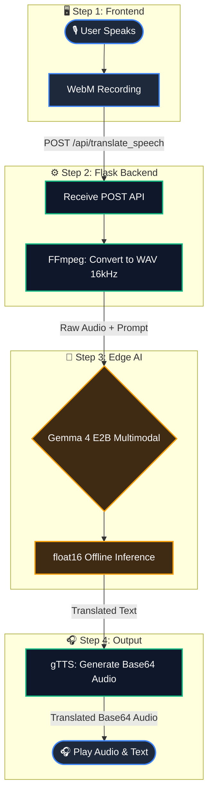

# 🌐 Gemma 4 Omni-Translator


**Multimodal Native Audio Translation powered by Google's Gemma 4 E2B.**

A 100% offline, privacy-first translation application that leverages the multimodal capabilities of Gemma 4 to natively understand spoken audio and translate it into 17 languages, complete with an EdTech-focused conversational UI.

---

## 💡 The Vision: Why this project?

Most translation apps rely on a multi-step pipeline (Speech-to-Text -> Text Translation -> Text-to-Speech) and send your voice data to the cloud. **Gemma 4 Omni-Translator** changes the paradigm:
1. **Edge AI & Privacy:** It runs entirely locally on consumer hardware (e.g., RTX 4050). No cloud APIs, no data harvesting. Perfect for sensitive environments like healthcare, corporate meetings, or offline travel.
2. **Native Automatic Speech Translation (AST):** Instead of using third-party transcription models like Whisper, this app feeds raw 16kHz audio directly into Gemma 4's multimodal architecture. The model *listens* and translates natively in a single pass.
3. **EdTech Integration:** Built with language learners in mind. The UI saves the original audio and the translated audio side-by-side, allowing users to practice "shadowing" (listen and repeat) to improve their pronunciation.

## ✨ Key Features

* **🎙️ Native Multimodal Audio:** Direct Audio-to-Text/Translation without intermediate transcription models.
* **💬 Auto-Swap Conversation Mode:** A fluid interface for real-time bilingual conversations without touching the mouse.
* **🎧 EdTech Shadowing:** Playback and download both your original voice recording and the generated translation.
* **🌍 17 Supported Languages:** English, Italian, French, Spanish, German, Portuguese, Polish, Turkish, Russian, Dutch, Czech, Arabic, Chinese, Japanese, Hungarian, Korean, and Hindi.
* **⚡ Zero-VRAM TTS:** Uses Google Text-to-Speech (`gTTS`) to generate high-quality audio responses without consuming precious GPU memory, leaving 100% of the VRAM for Gemma 4.

## 🏗️ Architecture Under the Hood



* **Core Model:** `google/gemma-4-E2B-it` (Loaded in `float16` for VRAM optimization).
* **Backend:** Python + Flask.
* **Audio Processing:** `ffmpeg` processes raw browser webm recordings into strict 16kHz mono WAV files required by the Gemma Omni-processor.
* **Frontend:** Vanilla HTML/CSS/JS with a responsive, modern, dark-mode UI.

---

## 🚀 How to Run Locally

If you have a CUDA-enabled GPU (minimum 6GB VRAM), you can run this entirely offline.

### 1. Prerequisites
* Python 3.11
* [FFmpeg](https://ffmpeg.org/) installed and added to your system's PATH.
* A Hugging Face account with accepted terms for the Gemma 4 model.

### 2. Installation
```bash
# Clone the repository
git clone https://github.com/federosso/gemma4-omni-translator.git
cd gemma4-omni-translator

# Create a virtual environment
python -m venv .venv
# On Windows use: .venv\Scripts\activate
# On Mac/Linux use: source .venv/bin/activate
.venv\Scripts\activate

# Install dependencies (ensure you get the correct PyTorch version for your CUDA)
pip install "torch>=2.6.0" torchvision torchaudio --index-url https://download.pytorch.org/whl/cu124
pip install -r requirements.txt

# Authenticate with Hugging Face (Paste your token when prompted)
huggingface-cli login
